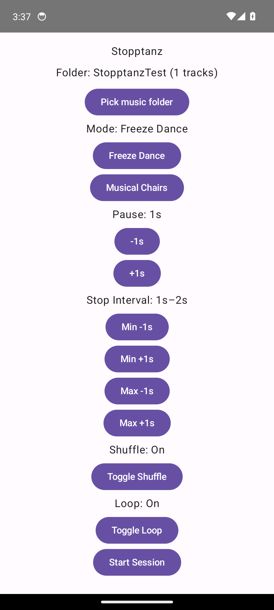
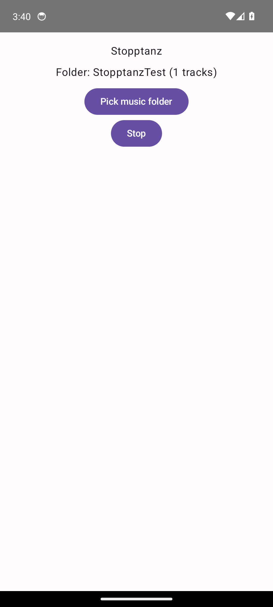
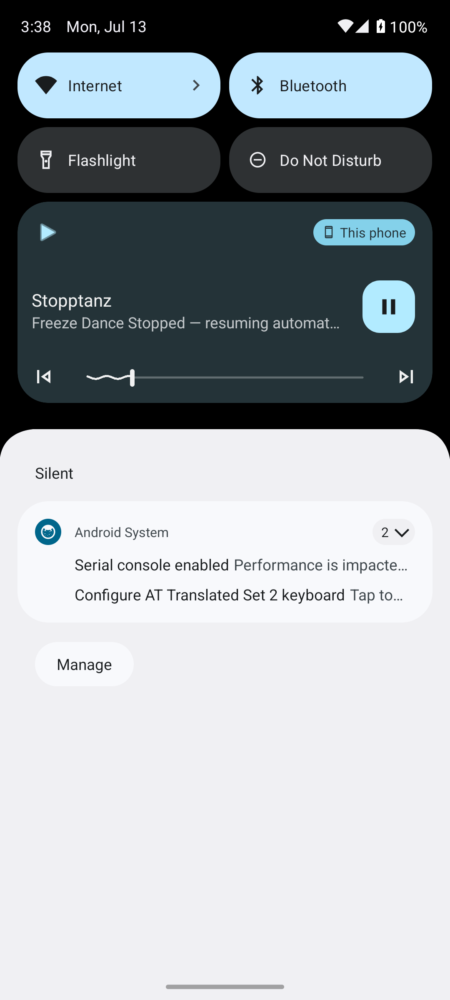

# Stopptanz

Android app that plays a local music file or playlist and randomly stops playback to drive a stop-dance party game (Freeze Dance / Musical Chairs). No player, chair, or score tracking — it's a music/timer engine only.

- **Freeze Dance mode**: music stops at a random point, then auto-resumes after a fixed pause (host can also resume early).
- **Musical Chairs mode**: music stops at a random point and stays stopped until the host resumes it manually.
- Configurable stop-interval range per mode, playlist shuffle/loop, seek/skip controls, system media notification controls.

No ads, no analytics, no tracking, no network access at all — see [PRIVACY.md](PRIVACY.md).

## Screenshots

<p>
  
  
  
  
</p>

## Building

Requires JDK 17.

```
./gradlew assembleDebug
```

The debug APK is written to `app/build/outputs/apk/debug/`.

## Development

This project was built with heavy AI assistance (Claude Code) under human direction — design, functionality, and testing/debugging decisions are the author's; implementation was AI-generated. The app icon was generated with GPT Image 2.

## License

GPL-3.0-or-later. See [LICENSE](LICENSE).
